# Documentation of Project6
## Step 1
1. I launched an EC2 instance that served as web-server
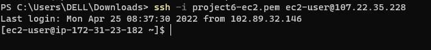

2. I created three volumes and attached it to the EC2 web server
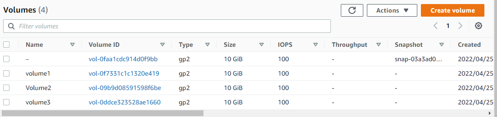

3. I used lsblk command to inspect the block devices that are attached to the server

`lsblk`
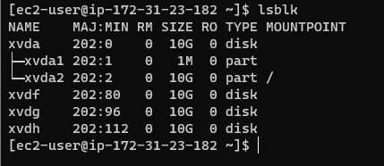

4. I used df -h command to see all mounts and free space on my server

`df -h`
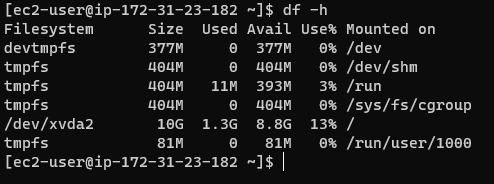

5. I used gdisk utility to create a single partition on each of the three disks

`sudo gdisk /dev/xvdf`
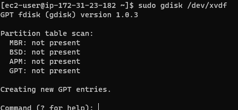
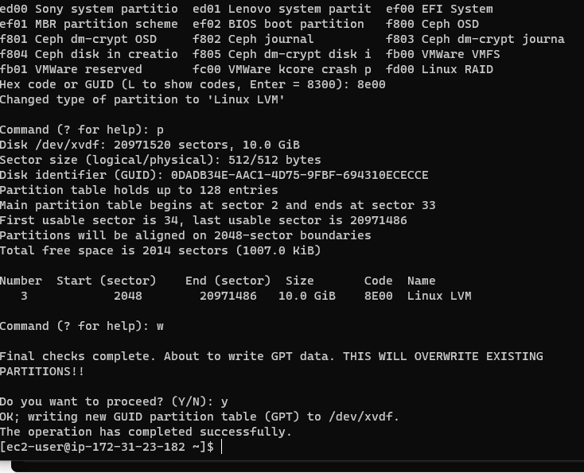

6. I used lsblk utility to view the newly configured partitions on each of the three disks

`lsblk`
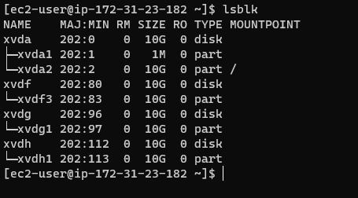

7. I installed lvm2 package

`sudo yum install lvm2`
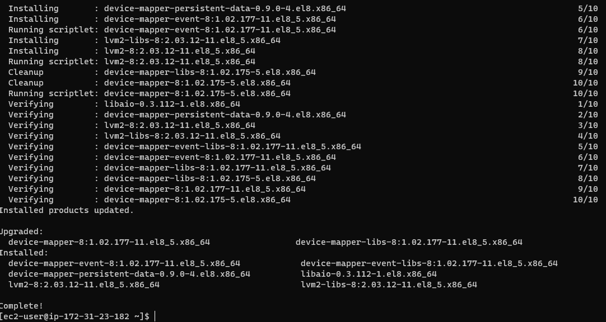

b. I ran lvmdiskscan to check for available partition

`sudo lvmdiskscan`
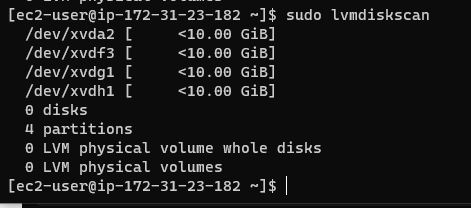

8. I used pvcreate utility to mark the three disks as physical volumes

`sudo pvcreate`
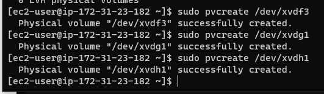

9. I ran sudo pvs to verify that my physical volume has been created

`sudo pvs`
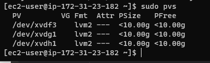

10. I used vgcreate utility to add all 3 PVs to a volume group

`sudo vgcreate webdata-vg /dev/xvdh1 /dev/xvdg1 /dev/xvdf1`
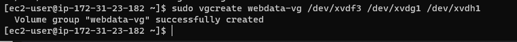

11. I verified that the vgs was created.

  `sudo vgs`
  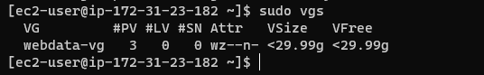

12. I used lvcreate utility to create two 2 logical volumes

`sudo lvcreate -n apps-lv -L 14G webdata-vg`
`sudo lvcreate -n logs-lv -L 14G webdata-vg`
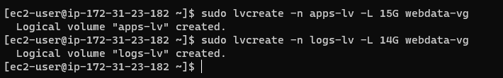

13. I verified that my logical volumes has been created successfully

`sudo lvs`
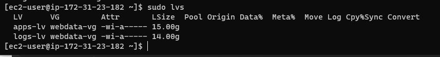

14. I formatted the logical volumes with ext filesystem
    
    `sudo mkfs -t ext4 /dev/webdata-vg/apps-lv`
    `sudo mkfs -t ext4 /dev/webdata-vg/logs-lv`
   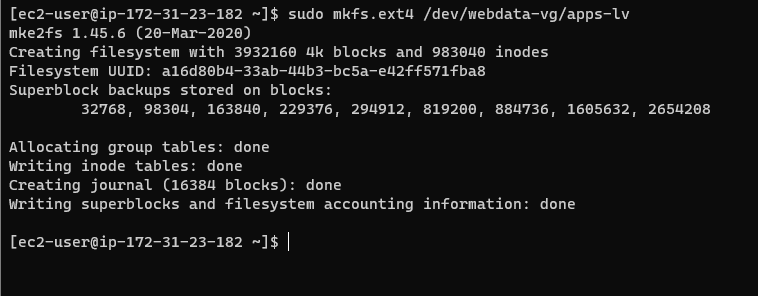
    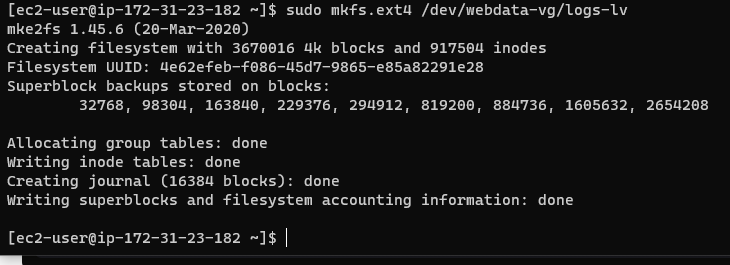

15. I created directory to store website files and  I created logs to store backup log data

    `sudo mkdir -p /var/www/html`
    `sudo mkdir -p /home/recovery/logs`
    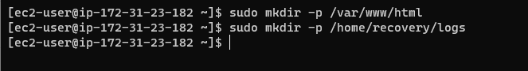

16.  I mount the directory on the apps-lv logical volume
     
     `sudo mount /dev/webdata-vg/apps-lv /var/www/html/`

17.  I used rsync to backup all the files in the log directory into home/recovery/logs
     
   `sudo rsync -av /var/log/. /home/recovery/logs/`
   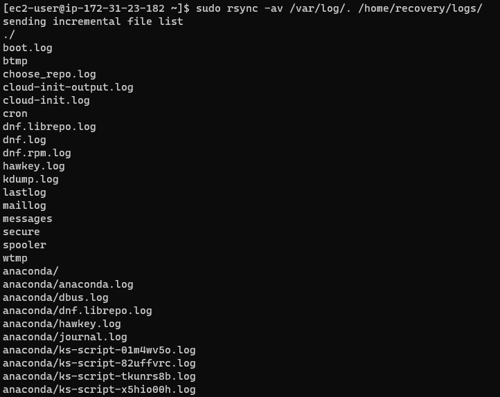

18. I mounted var/log on logs-lv

   `sudo mount /dev/webdata-vg/logs-lv /var/log`
   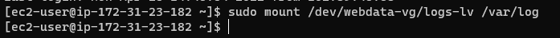

19. I restored log files back into var/log directory

    `sudo rsync -av /home/recovery/logs/. /var/log`
    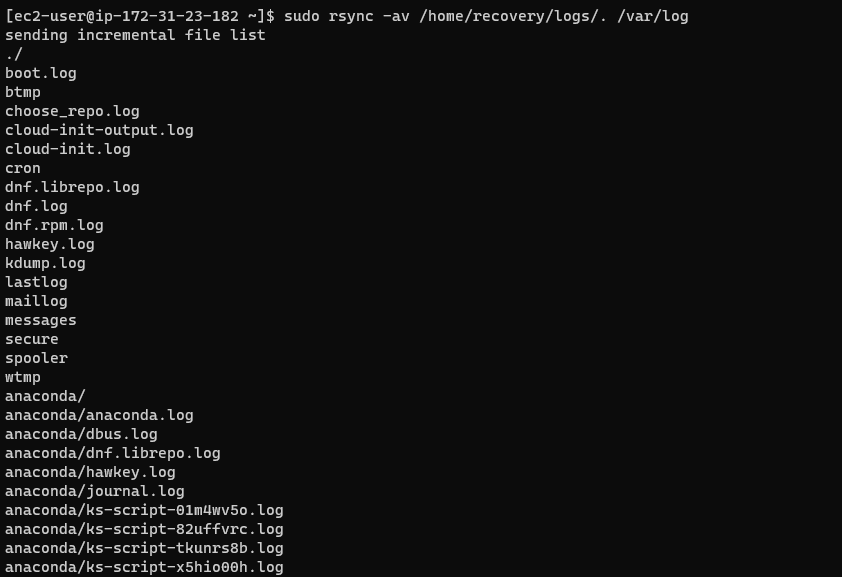

20. I updated the /etc/fstab file
   
   `sudo blkid`
   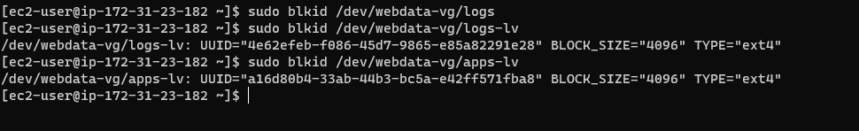

21. I tested the configuration and I verified my setup

     `sudo mount -a`
     `df -h`
    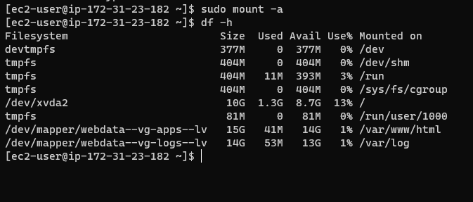

## Step 2
I prepared the database server using the same steps I used in creating web server
  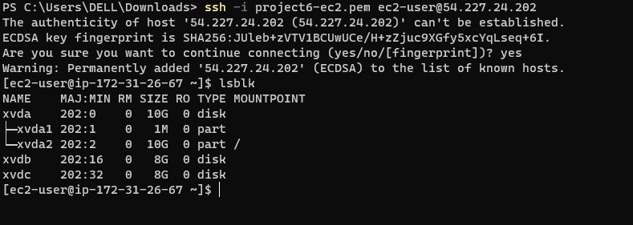
  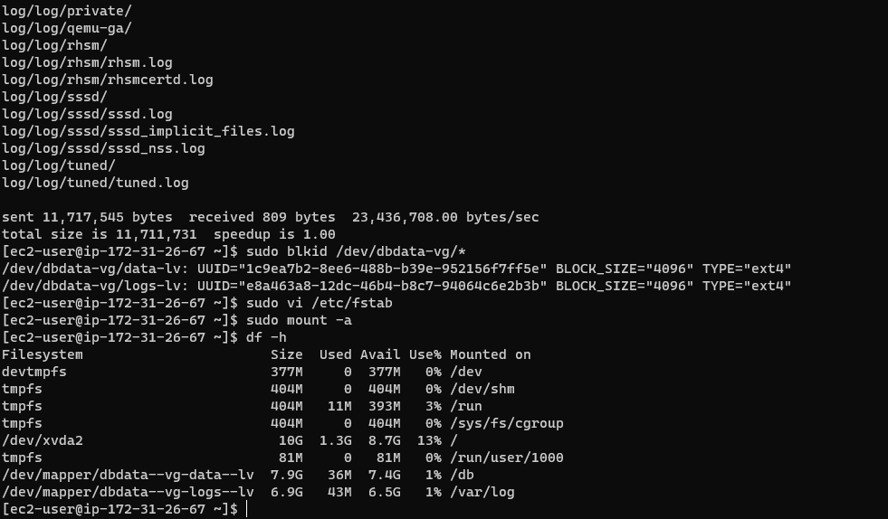

## Step 3
1. I updated the repository

   `sudo yum -y update`
   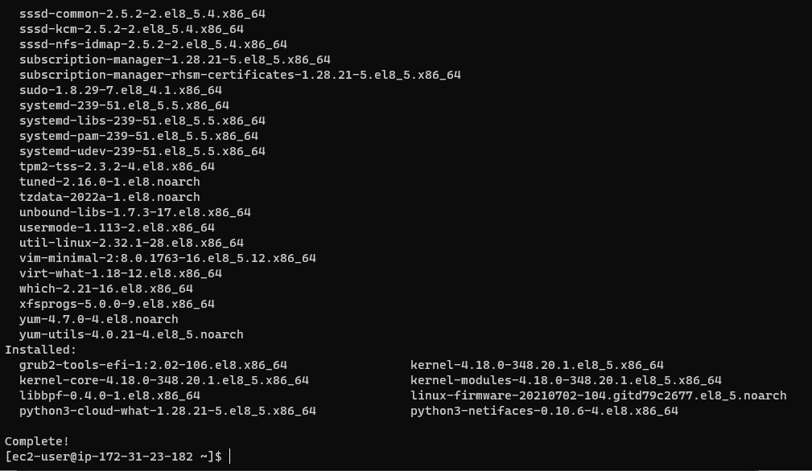

2. I installed wget, apache and its dependencies
    `sudo yum -y install wget httpd php php-mysqlnd php-fpm php-json`
    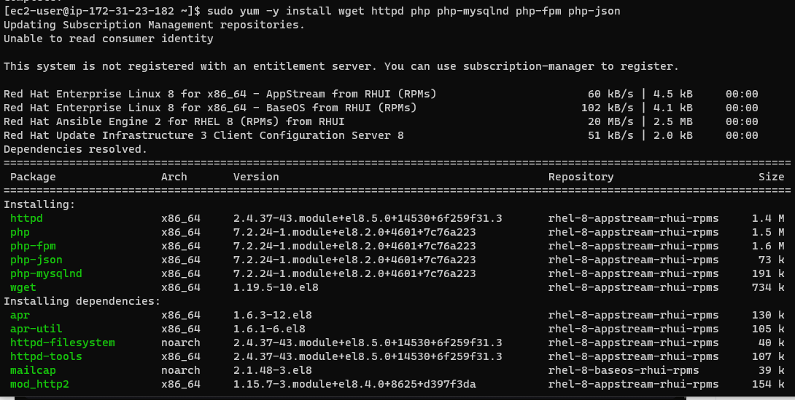

3. I started apache

    `sudo systemctl enable httpd`
     `sudo systemctl start httpd`
     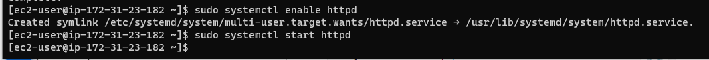

4. I installed php and its dependencies

   `sudo yum install https://dl.fedoraproject.org/pub/epel/epel-release-latest-8.noarch.rpm`
   `sudo yum install yum-utils http://rpms.remirepo.net/enterprise/remi-release-8.rpm`
   `sudo yum module list php`
`sudo yum module reset php`
`sudo yum module enable php:remi-7.4`
`sudo yum install php php-opcache php-gd php-curl php-mysqlnd`
`sudo systemctl start php-fpm`
`sudo systemctl enable php-fpm`
`setsebool -P httpd_execmem 1`
     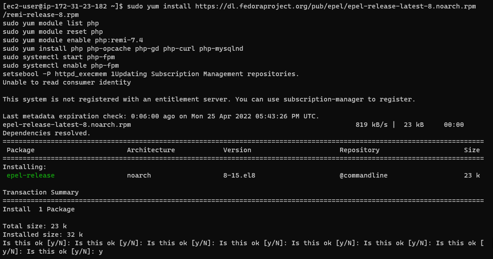
     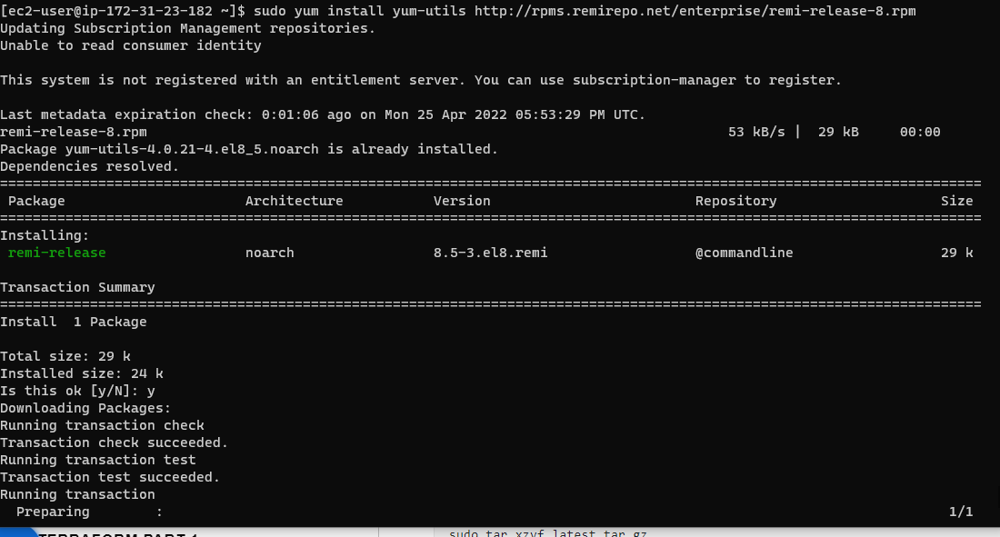
     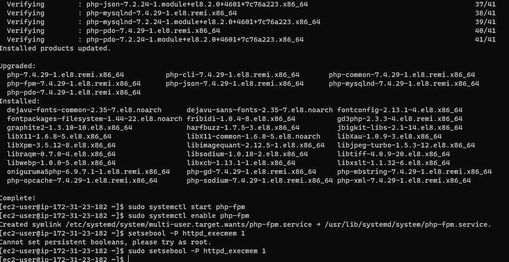

5.  I restarted apache
 
    `sudo systemctl restart httpd`
    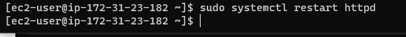

6.  I downloaded wordpress and copied it to var/www/html

   `mkdir wordpress`
  `cd   wordpress`
  `sudo wget http://wordpress.org/latest.tar.gz`
  `sudo tar xzvf latest.tar.gz`
  `sudo rm -rf latest.tar.gz`
  `cp wordpress/wp-config-sample.php wordpress/wp-config.php`
  `cp -R wordpress /var/www/html/`
   
   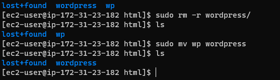

7.  I configured SELinux policies
    
     `sudo chown -R apache:apache /var/www/html/wordpress`
  `sudo chcon -t httpd_sys_rw_content_t /var/www/html/wordpress -R`
  `sudo setsebool -P httpd_can_network_connect=1`

     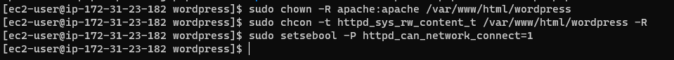

## Step 4
    I installed MYSQL on my DB server EC2

     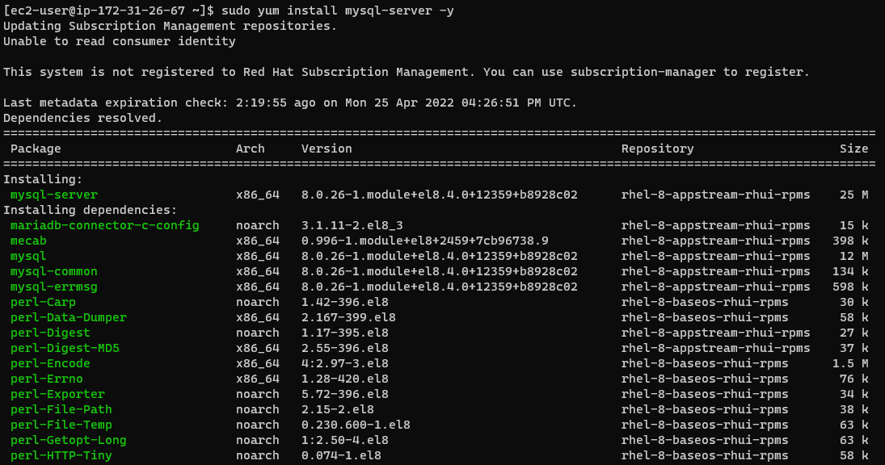
      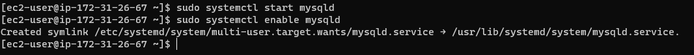

## Step 5
 I configured DB to work with wordpress
    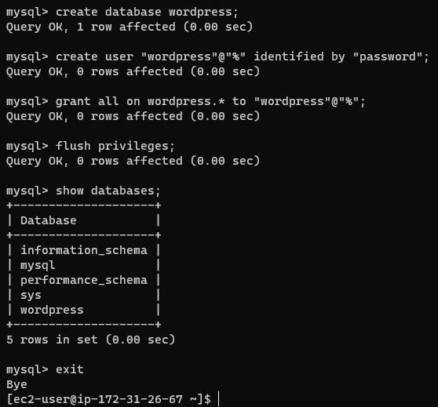

## Step 6
1. I installed MYSQL-client and tested if I could connect from the web-server to the DB server

   `sudo yum install mysql`
   `sudo mysql -u admin -p -h <DB-Server-Private-IP-address>`

2. I veriified if I could successfully execute "show databases;" command
    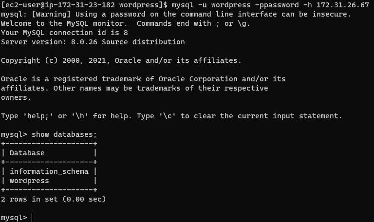

3. I changed permissions and configurations so that Apache can use wordpress

4. I enabled TCP port80 in inbound rules

5.  I tried to access the link to wordpress from my browser
     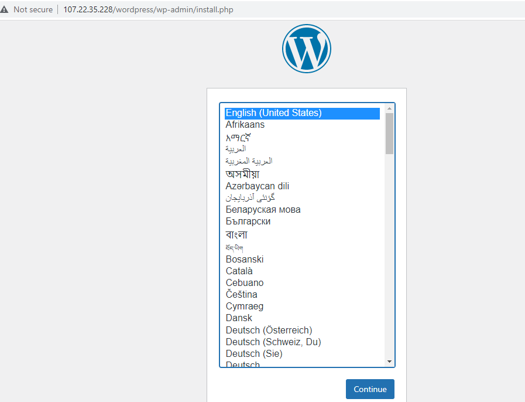

6.  It worked
     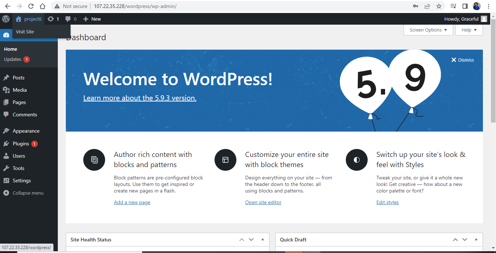